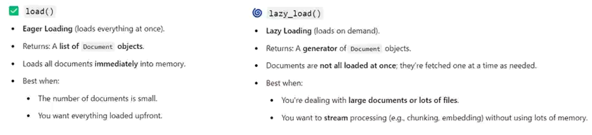

> **Document loaders**: are components in LangChain to load data from various sources into a standardized format (usually as Document objects) which can then be used for chunking, embedding, retrieval, and generation.

1. Text Loader: Takes text input and transform into document object. 
2. PDF Loader 
    - A PDF loader in LangChain is a type of Document Loader used to read and extract text or structured data from PDF files. It’s part of the langchain_community.document_loaders (previously `langchain.document_loaders`) module.
    - PyPDFLoader: Most common and reliable. Uses the pypdf library. Extracts text cleanly but not layout-aware. Metadata includes page numbers. **Use case**: Table-heavy or formatted documents.
    - PDFPlumberLoader: Uses the pdfplumber library. Can extract text with layout and tables. Slower but more accurate for structured PDFs.
    - PyMuPDFLoader (a.k.a. FitZ Loader): Uses the fitz (PyMuPDF) library. Can extract text, images, annotations, and metadata. Good balance between speed and accuracy. **Use case**: PDFs with mixed content (text + images).
    - PDFMinerLoader: Uses `pdfminer.six`. Good for text-heavy PDFs. Sometimes preserves spacing better than PyPDFLoader. Use case: Research papers or text-dense PDFs.
    - UnstructuredPDFLoader: Uses the `unstructured` library (powerful parsing framework). Can extract text, tables, images, and metadata blocks. More intelligent but requires `unstructured` dependency. Use case: Semi-structured PDFs (articles, reports, etc.)
    - Online PDF Loaders: If your PDF is hosted on a URL. Use case: Pull PDFs directly from the web (research papers, whitepapers, etc.)
    - OCR-based Loader for Scanned PDFs: If your PDF is scanned (no selectable text). Use OCR-based extractors, like UnstructuredPDFLoader with OCR, or integrate Tesseract / Azure Form Recognizer / Google Vision API / other OCR based models.

| Loader                              | Backend      | Strength                  | Use Case        |
| ----------------------------------- | ------------ | ------------------------- | --------------- |
| **PyPDFLoader**                     | pypdf        | Fast, reliable            | General PDFs    |
| **PDFPlumberLoader**                | pdfplumber   | Table & layout extraction | Data-heavy PDFs |
| **PyMuPDFLoader**                   | fitz         | Text + images             | Mixed content   |
| **PDFMinerLoader**                  | pdfminer.six | Text accuracy             | Research papers |
| **UnstructuredPDFLoader**           | unstructured | Intelligent parsing       | Complex layouts |
| **OnlinePDFLoader**                 | URL-based    | Fetch from web            | Remote PDFs     |
| **OCR (Unstructured or Tesseract)** | OCR engine   | Text from images          | Scanned docs    |

3. DirectoryLoader: DirectoryLoader is a document loader in LangChain that automatically scans a directory (folder) and loads all supported files inside it — applying the appropriate file-specific loader (like PDF, TXT, CSV, etc.) to each.

| Parameter            | Description                                                         |
| -------------------- | ------------------------------------------------------------------- |
| `path`               | Folder path to scan                                                 |
| `glob`               | File-matching pattern (e.g., `"*.pdf"`, `"**/*.txt"`)               |
| `loader_cls`         | Loader class used for each file (e.g., `PyPDFLoader`, `TextLoader`) |
| `show_progress`      | Show loading progress bar (default `False`)                         |
| `use_multithreading` | Load files concurrently (faster for large directories)              |

*Glob patterns*
| Pattern  | Meaning                                           | Example Matches                                       |
| -------- | ------------------------------------------------- | ----------------------------------------------------- |
| `*`      | Matches **anything** (except `/`)                 | `*.pdf` → `report.pdf`, `notes.pdf`                   |
| `?`      | Matches **exactly one** character                 | `file?.txt` → `file1.txt`, `fileA.txt`                |
| `**`     | Matches **any number of directories (recursive)** | `**/*.pdf` → all PDFs in this folder *and subfolders* |
| `[abc]`  | Matches **one character** from the list           | `file[123].txt` → `file1.txt`, `file2.txt`            |
| `[!abc]` | Matches any character **except** those listed     | `file[!1].txt` → `file2.txt`, `fileA.txt`             |

> Lazy load is good when you have a big number of PDFs, and it is harder to process all the PDFs in the memory. It load and process one document and remove the processed document from the memory.

4. WebBaseLoader: Good for static webpages, doesn't handle JS-heavy pages very well (use SeleniumURLLoader for that)

